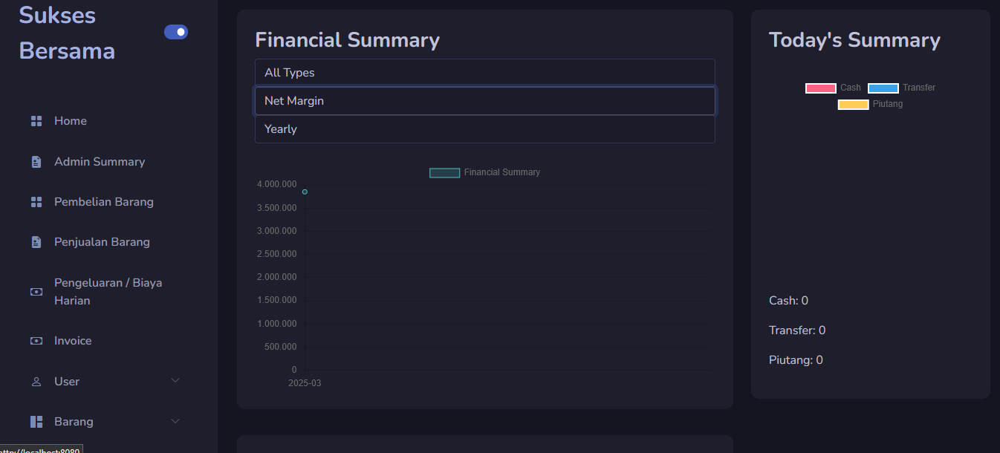
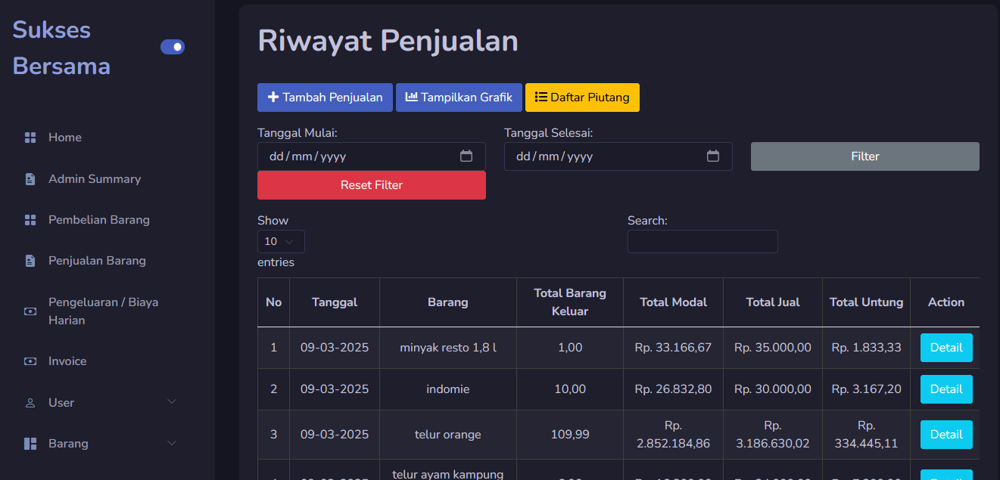
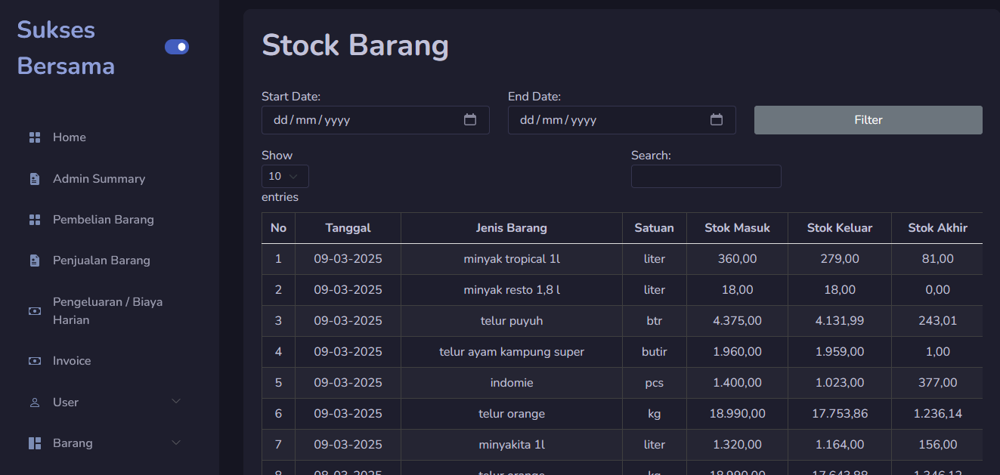
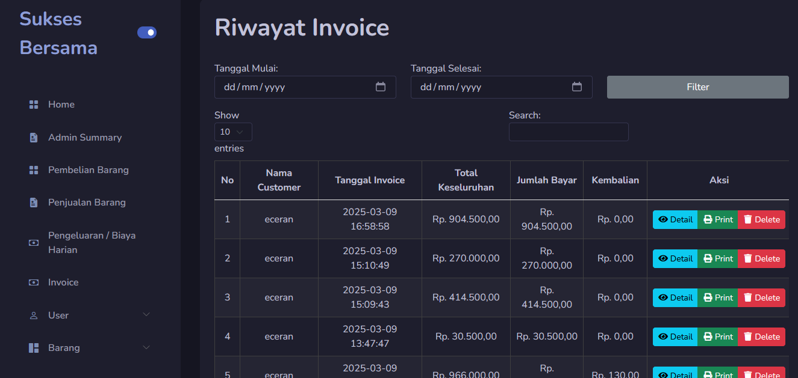
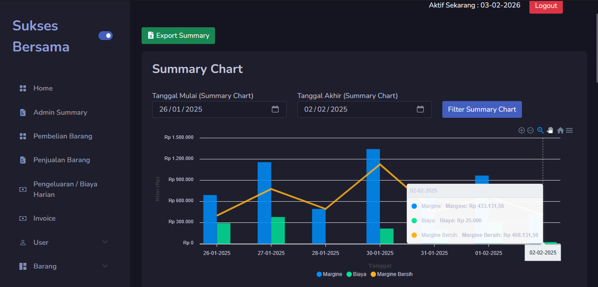

# Toko Sukses Bersama — Sistem Point of Sale

Sistem POS berbasis web untuk bisnis distribusi telur dan sembilan bahan. Dibangun menggunakan CodeIgniter 4 dan MySQL, sistem ini menangani penjualan harian, inventaris, pembayaran, faktur, dan pelaporan keuangan secara langsung di produksi.

## 📊 Statistik Produksi

Sistem ini berjalan dalam produksi aktif dari **Desember 2024 hingga Maret 2025**, memproses transaksi nyata setiap harinya.

| Metrik | Nilai |
|---|---|
| Transaksi Penjualan | 650+ |
| Detail Penjualan | 8.200+ |
| Faktur Terhasilkan | 2.650+ |
| Catatan Pembayaran | 9.900+ |
| Pelanggan Aktif | 131 |
| Pemasok | 11 |
| Produk Dilacak | 22 |
| Hari Beroperasi | 82+ |
| Total Pendapatan | ±Rp 530.000.000 |
| Total Keuntungan | ±Rp 55.000.000 |

---

## 💻 Teknologi yang Digunakan

| Lapisan | Teknologi |
|---|---|
| Framework | CodeIgniter 4 (PHP 8.1) |
| Database | MySQL / MariaDB |
| ORM | CI4 Query Builder |
| Frontend | Bootstrap 5, AdminLTE |
| Grafik | Chart.js |
| Tabel | DataTables |
| Autentikasi | Berbasis Session, hashing bcrypt |

---

## ✨ Fitur

### 📦 Manajemen Inventaris
- Katalog produk dengan 22 jenis produk dan berbagai varian satuan (misal: telur puyuh dijual per butir, per 10, per 15, per kg)
- Pelacakan stok real-time dengan perhitungan masuk-keluar dari pembelian dan penjualan
- Manajemen pemasok (11 pemasok tercatat)
- Penyesuaian dan rekonsiliasi stok

### 💰 Penjualan & Transaksi
- Antarmuka POS untuk memproses penjualan harian
- Dukungan 3 metode pembayaran: Tunai, Transfer Bank, dan Piutang
- Perhitungan keuntungan otomatis per transaksi (pendapatan dikurangi modal)
- Riwayat transaksi dengan filter tanggal

### 🧾 Faktur
- Pembuatan faktur per pelanggan
- Detail faktur yang terhubung dengan produk dan satuan
- Lebih dari 2.650 faktur terhasilkan selama produksi

### 📈 Pelaporan Keuangan
- Pelacakan margin dan keuntungan bersih harian
- Pencatatan pengeluaran dengan rincian per item
- Pelacakan pengumpulan piutang (sistem bulek)
- Ringkasan arus kas (meity) dengan jumlah terkumpul vs yang masih tertunggak

### 📊 Dashboard & Analitik
- Grafik interaktif menggunakan Chart.js
- Tampilan ringkasan untuk penjualan harian, margin, dan jumlah transaksi
- Rincian per metode pembayaran (tunai, transfer, piutang)
- Performa penjualan per produk

### 👥 Manajemen Pengguna
- Akses berbasis peran: Admin dan Petugas
- Autentikasi berbasis session
- Hashing kata sandi dengan bcrypt

---

## 📸 Screenshot

### Dashboard

Tampilan utama dengan grafik penjualan dan ringkasan harian

### Penjualan

Antarmuka untuk memproses dan melihat riwayat penjualan

### Stok & Inventaris

Pelacakan stok real-time per produk

### Faktur

Tampilan faktur yang terhasilkan

### Laporan Keuangan

Laporan harian dan bulanan

---

## 🗄️ Desain Database

**19 tabel + 8 view**

### Tabel Utama

| Tabel | Fungsi |
|---|---|
| `tbl_tipe_barang` | Jenis / kategori produk |
| `tbl_unit_barang` | Varian satuan per produk (misal: per butir, per kg, per dus) |
| `tbl_customer` | Data pelanggan |
| `tbl_supplier` | Data pemasok |
| `tbl_payment_method` | Jenis pembayaran (Tunai, Transfer, Piutang) |
| `tbl_user` | Pengguna sistem dan peran |

### Tabel Transaksi

| Tabel | Fungsi |
|---|---|
| `tbl_penjualan` | Header transaksi penjualan (tanggal, produk, pendapatan, modal, keuntungan) |
| `tbl_detail_penjualan` | Detail penjualan (pelanggan, jumlah, harga, referensi pembayaran) |
| `tbl_pembelian` | Header pesanan pembelian |
| `tbl_detail_pembelian` | Detail pembelian (jumlah masuk, biaya per satuan) |
| `tbl_payment` | Catatan pembayaran (jumlah, metode, tanggal) |
| `tbl_invoices` | Header faktur |
| `tbl_invoice_items` | Detail faktur |

### Tabel Keuangan

| Tabel | Fungsi |
|---|---|
| `tbl_pengeluaran` | Header pengeluaran (total harian) |
| `tbl_detail_pengeluaran` | Detail pengeluaran (gaji, perlengkapan, transportasi, dll.) |
| `tbl_bulek` | Pelacakan pengumpulan penjualan kredit (piutang) |
| `tbl_meity` | Pelacakan hutang pembelian per pemasok |
| `tbl_sisa_terkumpul` | Catatan saldo yang terkumpul |
| `tbl_stock` | Snapshot stok per produk per tanggal |

### View Pelaporan

| View | Fungsi |
|---|---|
| `vw_summary` | Ringkasan penjualan harian dengan margin, pengeluaran, keuntungan bersih, jumlah transaksi per metode pembayaran |
| `vw_summary_per_barang` | Ringkasan yang sama tetapi dirincikan per jenis produk |
| `vw_detail_penjualan` | Detail penjualan lengkap yang menghubungkan pelanggan, produk, satuan, pembayaran |
| `vw_bulek_detail` | Pelacakan piutang dengan saldo tersisa per transaksi |
| `vw_bulek_detail_biaya` | Pelacakan piutang termasuk potongan pengeluaran |
| `vw_bulek_totals` | Jumlah piutang yang digabungkan per produk |
| `vw_meity` | Ringkasan hutang pembelian per pemasok dengan status pembayaran |
| `view_stock_with_sisa_per_unit` | Rekonsiliasi stok: total masuk vs total keluar vs sisa |

---

## 🏗️ Arsitektur

```
/app
├── Controllers/          
│   ├── Dashboard.php     → Analitik, grafik, tampilan ringkasan
│   ├── Penjualan.php     → Pemrosesan dan riwayat penjualan
│   ├── Pembelian.php     → Pesanan pembelian
│   ├── Stock.php         → Manajemen inventaris
│   ├── Pengeluaran.php   → Pelacakan pengeluaran
│   ├── Bulek.php         → Manajemen piutang
│   ├── Invoice.php       → Pembuatan faktur
│   ├── Laporan.php       → Laporan
│   └── Auth.php          → Login / Logout
├── Models/               → Lapisan akses database (CI4 Query Builder)
├── Views/                → Template UI (Bootstrap 5 + AdminLTE)
└── Config/               → Konfigurasi aplikasi
```

---

## 🚀 Instalasi

### Persyaratan
- PHP 8.1+
- MySQL 8.0+ atau MariaDB 10.4+
- Composer
- Apache atau Nginx dengan mod_rewrite

### Langkah-langkah

```bash
# 1. Clone repository
git clone https://github.com/AeonForts/Aplikasi-web-toko-sukses-bersama-php-ci4.git
cd Aplikasi-web-toko-sukses-bersama-php-ci4

# 2. Install dependencies
composer install

# 3. Konfigurasi environment
cp env .env
# Buka .env dan ubah nilai berikut:
#   database.default.hostname = 127.0.0.1
#   database.default.database = db_toko_sukses_bersama
#   database.default.username = root
#   database.default.password = (kata sandi Anda)

# 4. Buat database dan import schema
mysql -u root -p
# mysql> CREATE DATABASE db_toko_sukses_bersama;
# mysql> USE db_toko_sukses_bersama;
# mysql> SOURCE database/database.sql;

# 5. Jalankan server pengembangan
php spark serve
```

### Login Default
```
Username: admin
Kata Sandi: 123
```

---

## 🎓 Pembelajaran & Tantangan

**1. Database View vs Logika Aplikasi**
Kueri pelaporan melibatkan beberapa JOIN di antara penjualan, pembayaran, pelanggan, dan produk. Logika agregasi yang kompleks dipindahkan ke view MySQL agar backend tetap ringan dan kueri tetap cepat. Trade-off: lebih berat di sisi database, lebih ringan di sisi server aplikasi PHP.

**2. Pelacakan Penjualan Kredit (Piutang)**
Banyak pelanggan merupakan akun grosir yang membayar secara kredit. Sistem pelacakan pengumpulan (`tbl_bulek`) dibangun untuk melacak pembayaran per transaksi dan menghitung saldo yang masih tertunggak. Ini memerlukan penanganan pembayaran sebagian dan rekonsiliasi harian yang cermat.

**3. Penetapan Harga Produk Multi-Satuan**
Produk seperti telur puyuh dijual dalam berbagai ukuran satuan (per butir, per 10, per 15, per kg). `tbl_unit_barang` dirancang untuk menangani varian satuan dengan harga standar, dan lapisan penjualan mengonversi kuantitas ke satuan dasar untuk perhitungan inventaris.

**4. Rekonsiliasi Stok**
`view_stock_with_sisa_per_unit` dibuat untuk secara otomatis merekonsiliasi stok dengan menghitung total pembelian masuk dikurangi total penjualan keluar hingga tanggal tertentu. Ini memberikan tampilan real-time tentang sisa inventaris tanpa perlu menghitung secara manual.

**5. Rincian Pengeluaran Harian**
Pemilik toko melacak semua pengeluaran harian (gaji, transportasi, perlengkapan) secara detail. Struktur header-detail (`tbl_pengeluaran` + `tbl_detail_pengeluaran`) dibangun yang kemudian digabungkan menjadi total harian yang digunakan oleh dashboard.

---

## 📝 Catatan

- File database di `/database/` berisi data produksi yang telah disanitasi. Kredensial pengguna dan informasi kontak asli telah dihapus.
- Folder `vendor/` disertakan di repo ini untuk kemudahan. Dalam produksi, gunakan `composer install` sebagai gantinya.
- Sistem ini dirancang untuk deployment localhost satu lokasi. Konektivitas cloud/internet tidak diperlukan selama penggunaan produksi.

---

## 📄 Lisensi

MIT — lihat [LICENSE](LICENSE)